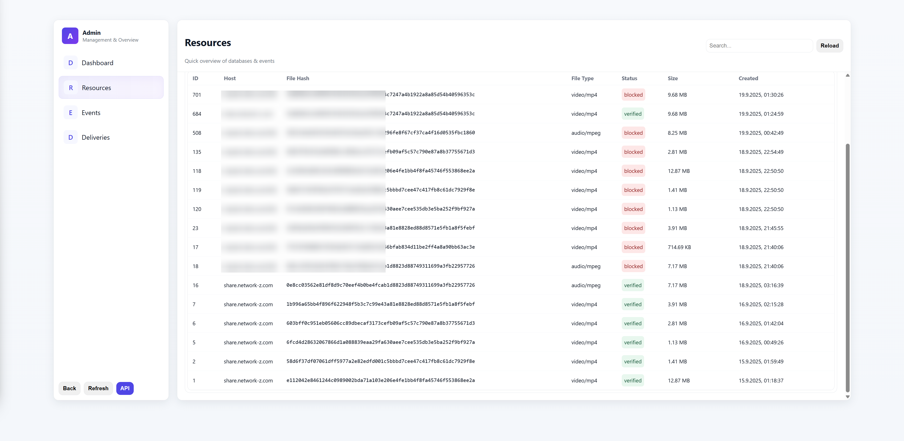

# SilentShare

 

SilentShare is meant to be a new decentralized file sharing software for servers and users. Similar to [Nostr](https://en.wikipedia.org/wiki/Nostr), SilentShare uses a similar way of communication, like events in JSON format and private/public key signing and verification. Tho its similar it comes with a few additions, like:

- **Fully** tamper proof events
- Automatic **penalties**
  - Spam penalties
  - Incorrect event data
  - Manually voted penalties
- Rate Limits
  - When a server rate limits a request it will automatically go to the next available server, acting like a load balancer!

These penalties are for the many different servers that relay requests or serve files through the network as there is no real client to client communication. Every Server Node has a trust score of a server. With each penalty, that trust score is going down, until the server gets automatically blocked. This way bad actors are automatically being purged from the network.

 

## File Syncing

Basically servers will exchange their data (files and or file host locations) with other servers in order to sync the network, similar to DNS servers. This means eventually you can connect to any server and get the same file from different sources.

It **will** also come with a few cool features like a copy counter based on the amount of servers known that host a specific file, basically acting like a CDN, so that if a server goes down the file will automatically be replicated again, tho only to a certain amount so the file isnt copied endlessly across all servers. There will also be a bypass so that if the copy limit is reached, but lets say the ping is too high, it will copy it anyway, so files are always served as good as possible.

This way if a client from europe fetches a file from america, the european server would still copy the file anyway for better latency.

The copy limit is a local server config variable. It means that you could set it to 0 and only store the references to hosts that have the file stored and run everything on a raspberry pi to just relay file information. With a external drive you may be able to run everything on a raspberry pi actually.

 

## User Interface

As of right now the main user interface is pretty basic, featuring some basic categories and a search system. I plan to make the categories dynamic and or server dependant. Currently this is what any users sees when connecting to a server. 

Listed resources are pinged before listing to ensure availability. If a host is down but multiple hosts for a file a known it will cicle through all hosts until it found a working one. This means that you can find files across the entire network!

Generally every user can upload files on default. 

 

## Admin Interface

There's also a admin interface to manage resources and in the future to manage events as well once theyare implemented. You can also block resources received from other servers. Its also planned to add a `Settings` section so your server config can be edited directly like rate limits, upload size limits etc.

> [!NOTE]
>
> This is where the manual penalty vote would be implemented as example so if a resource is considered illegal a vote will be cast across the network to remove the resource and block the servers hosting said file.

 

## Current Network State

Currently file syncing isnt implemented yet as well as the automatic penalties because there are a few small things i need to figure out yet and plan so i can implement these features in the best possible way so that its not becoming painful in the future. 

Currently only the syncing of resources work, which means if server 1 and 2 know each other, they can share their file informations with each other, and if a client connects to either server 1 or 2, he will still be able to view all files from both servers. So basically it works, just the actual file syncing too isnt done yet.

Other than the network syncing stuff everything is working from the pov of a "single instance". Users and admins can upload files, you can set upload limits, you can verify, unlist, block etc file resources etc.

Donations would help me a lot as it means i can spend more time on the development.
